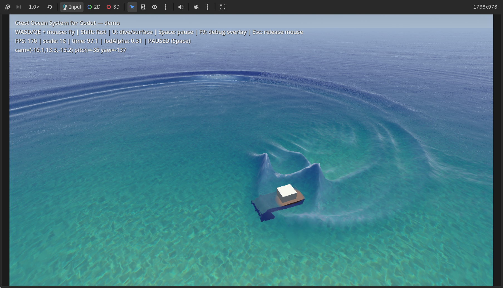

# Crest Ocean System for Godot

A port of the **[Crest ocean system](https://github.com/wave-harmonic/crest)**
(Unity, MIT license, by Wave Harmonic and contributors) to **Godot 4.6**,
implemented with GDScript + `RenderingDevice` compute shaders.

Crest is a technically advanced ocean framework: a view-following LOD chain
of cascades, physically-based wave spectra, and a suite of interacting GPU
simulations (foam, dynamic waves, flow, shadows...). This port reproduces
that architecture and its feature set for Godot.

<p float="left">
  
</p>

## Features

- **View-following LOD ocean surface** — concentric geometry rings with
  skirts to the horizon, crack-free LOD morphing, power-of-two scaling with
  camera altitude (port of `OceanBuilder`/`LodTransform`)
- **Gerstner waves** (`CrestShapeGerstner`) — stratified spectrum sampling,
  per-cascade wavelength bucketing, evaluated on the GPU
- **FFT waves** (`CrestShapeFFT`) — full GPU pipeline: spectrum
  initialisation (Pierson-Moskowitz-style wind damping + directional
  spreading), per-frame spectrum update, separable radix-2 IFFT
- **Wave spectrum resource** (`CrestWaveSpectrum`) — 14-octave log-power
  spectrum, port of `OceanWaveSpectrum` (incl. Pierson-Moskowitz editor
  utility)
- **Animated waves cascade** — displacement + small-wave variance, with the
  combine pass accumulating large wavelengths downwards
- **Foam simulation** — Jacobian-crest injection, shoreline injection,
  advection by flow, dissipation, prewarm
- **Dynamic waves simulation** — damped wave equation with CFL clamping,
  shallow-water attenuation, shoreline reflection, sphere interaction
  injection (wakes/ripples), horizontal sharpening on combine
- **Sea floor depth** — depth inputs + `CrestOceanDepthCache` (top-down
  terrain height capture), drives shoreline foam, wave attenuation and
  shallow-water scattering
- **Flow** — flow maps / fixed-direction inputs, advects foam and dynamic
  waves
- **Shadow simulation** — soft/hard shadow factors via jittered sampling +
  exponential moving average accumulation (occluders registered analytically,
  see *Differences*)
- **Clip surface** — remove the ocean surface in registered areas (boat
  hulls, docks)
- **Albedo inputs** — locally override the water scattering colour
- **Water surface shader** — port of Crest's `Ocean.shader`: displacement
  blending, detail normal maps, SSS through wave crests, foam (white caps +
  bubbles + 3D lighting), Schlick fresnel with procedural sky / planar
  reflections, refraction with per-channel Beer-Lambert absorption, caustics
  with focal depth and distortion, shoreline feathering, underwater backface
  (Snell's window)
- **Underwater post-processing** (`CrestUnderwaterRenderer`) — depth-based
  underwater fog and meniscus
- **Planar reflections** (`CrestOceanPlanarReflection`) — mirrored camera
  capture feeding the surface shader
- **Buoyancy & queries** — `CrestSimpleFloatingObject`, `CrestBoatProbes`,
  `CrestSphereWaterInteraction`, and the `CrestCollision` query API
  (height/normal/velocity sampling, analytic Gerstner mirror)
- **Time provider** — pause/scale/external clock support

## Requirements

- Godot **4.6+**, Forward+ or Mobile renderer (RenderingDevice required)
- The legacy/Compatibility renderer is not supported

## Quick start

1. Copy `addons/crest` into your project and enable the plugin
   (*Project > Project Settings > Plugins > Crest Ocean System*).
2. Add a `CrestOceanRenderer` node to your scene.
3. Add a `CrestShapeGerstner` (or `CrestShapeFFT`) node anywhere in the
   scene; assign a `CrestWaveSpectrum` resource (created automatically with
   defaults if left empty).
4. Make sure your scene has a `Camera3D` and a `DirectionalLight3D`.
5. Run. Tweak wave and material parameters on the spectrum resource and the
   auto-created ocean material (see `CrestOceanRenderer > ocean_material`).

Minimal code-only setup:

```gdscript
var ocean := CrestOceanRenderer.new()
add_child(ocean)
var waves := CrestShapeGerstner.new()
waves.spectrum = CrestWaveSpectrum.new()
ocean.add_child(waves)
```

Useful things to attach:

- `CrestSimpleFloatingObject` / `CrestBoatProbes` under a `RigidBody3D` —
  buoyancy
- `CrestSphereWaterInteraction` on moving objects — wakes and ripples
- `CrestOceanDepthCache` or `CrestRegisterSeaFloorDepthInput` — shoreline
  foam and shallow-water colours
- `CrestRegisterFoamInput` / `...FlowInput` / `...ClipSurfaceInput` /
  `...AlbedoInput` / `...ShadowInput` — local inputs to the sims
- `CrestUnderwaterRenderer` — underwater fog when the camera dives
- `CrestOceanPlanarReflection` — true planar reflections on the surface

Query the water from gameplay code:

```gdscript
var out := [0.0]
if CrestCollision.sample_height(Vector2(x, z), out):
    var water_y: float = out[0]
```

## Demo

`demo/main.tscn` (the project's main scene) shows Gerstner waves over a
view-following LOD ocean, an island fed by an `CrestOceanDepthCache`
heightmap, floating objects with buoyancy and wakes, planar reflections and
the underwater effect. Controls: **WASD/QE + mouse** to fly (Shift = fast),
**Space** to pause/resume (camera and HUD stay live, so the frozen frame can
be inspected from any angle; the HUD shows the frozen ocean time and live
camera pose), **U** to dive/surface, **F9** for the simulation debug overlay.

## Architecture

All simulations live in `Texture2DArray`s with one layer per LOD cascade
(bridged from `RenderingDevice` textures via `Texture2DArrayRD`), updated by
GLSL compute shaders, mirroring Crest's command-buffer build order:
SeaFloorDepth → Flow → DynamicWaves → AnimatedWaves → Foam → ClipSurface →
Albedo (+ Shadow). The surface shader samples the animated-waves cascade
with dual-cascade blending exactly like Crest.

See `AGENTS.md` for contributor notes and platform pitfalls.

## Differences from Unity Crest

- **Shadow sim** reads analytic occluders registered via
  `CrestRegisterShadowInput` instead of the engine shadow map (Godot does
  not expose the main-light shadow map to `RenderingDevice`). The jitter +
  accumulation framework is identical.
- **Planar reflections** currently approximate the oblique near-plane clip.
- **Underwater** uses an analytic meniscus approximation rather than the
  ocean-mask prepass.
- Collision queries use an exact CPU mirror of the Gerstner evaluation;
  GPU readback queries (needed for exact FFT collisions) are planned.
- Water bodies / splines / networking providers are not yet ported.

## Performance

On an Apple M5 (Metal, 256² cascades, 7 LODs, foam + dynamic waves):
~120 FPS in the demo scene. Sim cost scales with `lod_data_resolution`².

## License

MIT — same as upstream Crest. This port is © 2026 crest-godot contributors;
Crest is © 2019 Wave Harmonic and contributors. See `LICENSE`.

Bundled textures (`foam.png`, `Foam2.png`, `caustics.png`,
`wave_normals.png`) and the GPU noise routines ship from Crest under MIT;
see `addons/crest/textures/` for source attribution.
